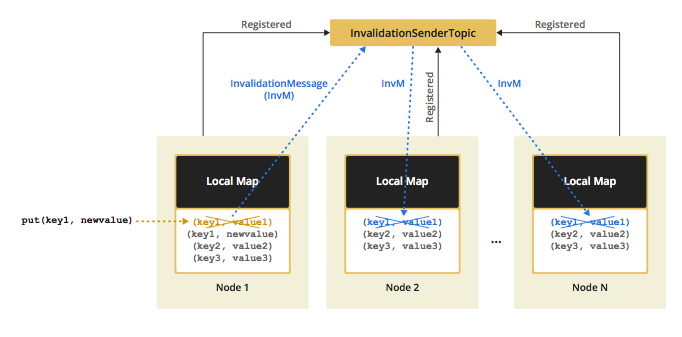

# Hibernate Second Level Cache

<a href="https://github.com/hazelcast/hazelcast-hibernate/actions?query=event%3Apush+branch%3Amaster"></a>
[](https://maven-badges.herokuapp.com/maven-central/com.hazelcast/hazelcast-hibernate53) 

Hazelcast provides a distributed second-level cache for your Hibernate entities, collections, and queries.

You can use an `IMap` as distributed storage(`HazelcastCacheRegionFactory`), or ConcurrentHashMap-based near-cache(`HazelcastLocalCacheRegionFactory`) with updates synchronized via `ITopic`.

## Supported Versions

- `hazelcast-hibernate53` supports Hibernate 5.3+, and Hazelcast 4+

<sub>If you need Hazelcast 3.x support, you can use a 1.3.x version of each `hazelcast-hibernate` module.</sub>

## Examples
- [Spring Boot Data JPA](https://guides.hazelcast.org/springboot-hibernate/)
- [Hibernate with JCache](https://guides.hazelcast.org/hibernate-jcache/) 

## Documentation

# Table of Contents

* [Hibernate Second Level Cache](#hibernate-second-level-cache)
  * [Supported Hibernate and Hazelcast Versions](#supported-hibernate-and-hazelcast-versions)
  * [Configuring Hibernate for Hazelcast](#configuring-hibernate-for-hazelcast)
    * [Enabling Second Level Cache](#enabling-second-level-cache)
    * [Configuring RegionFactory](#configuring-regionfactory)
      * [HazelcastCacheRegionFactory](#hazelcastcacheregionfactory)
      * [HazelcastLocalCacheRegionFactory](#hazelcastlocalcacheregionfactory)
    * [Configuring Query Cache and Other Settings](#configuring-query-cache-and-other-settings)
    * [Asynchronous Reconnect](#async-reconnect)
    * [Spring Boot Configuration](#spring-boot-configuration)
  * [Configuring Hazelcast for Hibernate](#configuring-hazelcast-for-hibernate)
  * [Setting P2P for Hibernate](#setting-p2p-for-hibernate)
  * [Setting Client/Server for Hibernate](#setting-client-server-for-hibernate)
  * [Configuring Cache Concurrency Strategy](#configuring-cache-concurrency-strategy)
  * [Advanced Settings](#advanced-settings)

## Configuring Hibernate for Hazelcast

To configure Hibernate for Hazelcast:

- Add the jar to your classpath (depending on your Hibernate/Hazelcast versions)
- Enable Second-Level Cache
- Choose a desired `RegionFactory` implementation
- Configure remaining properties by:
    - Adding them to your Hibernate configuration file, e.g., `hibernate.cfg.xml`
    - Adding them to Spring Boot's `application.properties` prefixed with `spring.jpa.properties`, e.g., `spring.jpa.properties.hibernate.cache.use_second_level_cache=true`

### Enabling Second Level Cache

```xml
<property name="hibernate.cache.use_second_level_cache">true</property>
```

### Configuring RegionFactory

You can configure Hibernate RegionFactory with `HazelcastCacheRegionFactory` or `HazelcastLocalCacheRegionFactory`.

#### HazelcastCacheRegionFactory

`HazelcastCacheRegionFactory` uses standard Hazelcast distributed maps to cache the data, so all cache operations go through the wire.

```xml    
<property name="hibernate.cache.region.factory_class">
   com.hazelcast.hibernate.HazelcastCacheRegionFactory
</property>
```

All operations like `get`, `put`, and `remove` will be performed on a distributed map. The only downside of using `HazelcastCacheRegionFactory` may be lower performance compared to `HazelcastLocalCacheRegionFactory` since operations are handled as distributed calls.
___
***NOTE:*** *If you use `HazelcastCacheRegionFactory`, you can see your maps on [Management Center](http://docs.hazelcast.org/docs/management-center/latest/manual/html/index.html).*
___
With `HazelcastCacheRegionFactory`, all below caches are distributed across Hazelcast Cluster:

- Entity Cache
- Collection Cache
- Timestamp Cache

#### HazelcastLocalCacheRegionFactory

You can use `HazelcastLocalCacheRegionFactory`, which stores data in a local member and sends invalidation messages when an entry is changed locally.

```xml
<property name="hibernate.cache.region.factory_class">
  com.hazelcast.hibernate.HazelcastLocalCacheRegionFactory
</property>
```

With `HazelcastLocalCacheRegionFactory`, each cluster member has a local map, and each of them is registered to a Hazelcast Topic (ITopic). 
Whenever a `put` or `remove` operation is performed on a member, `hazelcast-hibernate` sends an invalidation message to other members, 
which removes related entries from their local storage. 

In the `get` operations, invalidation messages are not generated, and reads are performed on the local map.

An illustration of the above logic is shown below:



If your operations consist mostly of reads, then this option gives better performance.
___
***NOTE:*** *If you use `HazelcastLocalCacheRegionFactory`, you cannot see your maps on [Management Center](https://docs.hazelcast.org/docs/management-center/latest/manual/html/index.html).*
___
With `HazelcastLocalCacheRegionFactory`, all of the following caches are not distributed and are kept locally:

- Entity Cache
- Collection Cache
- Timestamp Cache

_Entity_ and _Collection_ caches are invalidated on update. When they are updated on a member, an invalidation message is sent to
all other members in order to remove the entity from their local cache.

When needed, each member reads that data from the underlying datasource.

On every _Timestamp_ cache update, `hazelcast-hibernate` publishes an invalidation message to a topic (see
#hazelcastlocalcacheregionfactory for details).

#### Configuration

Local region cache eviction can be configured using the following parameters:

- _time-to-live_ - defining the lifespan of cache entries (defaults to 1 hour)
- _size_ - defining the maximum cache size, meaning depends on the `max-size-policy`,
- _max-size-policy_ - defining the max size policy used for eviction. Available values are as follows:
  - `PER_NODE` - Maximum number of map entries in the local cache. This is the default policy.
  - `FREE_HEAP_SIZE` - Minimum free heap size in megabytes for the JVM.

Above can be configured in your Hazelcast configuration file:

```xml

<map name="your-cache-name">
  <time-to-live-seconds>60</time-to-live-seconds>
  <eviction size="150" max-size-policy="PER_NODE"/>
</map>
```

### Configuring Query Cache and Other Settings

- To enable use of query cache:

    ```xml
    <property name="hibernate.cache.use_query_cache">true</property>
    ```

- To force minimal puts into query cache:

    ```xml
    <property name="hibernate.cache.use_minimal_puts">true</property>
    ```

- To avoid `NullPointerException` when you have entities that have composite keys (using `@IdClass`):

    ```xml
    <property name="hibernate.session_factory_name">yourFactoryName</property>
    ```
___
***NOTE:*** *QueryCache is always LOCAL to the member and never distributed across Hazelcast Cluster.*
___
#### Other Properties
- _cleanup_delay_ - the duration of physical local cache cleanups
- _cluster_timeout_ - the number of milliseconds the client should retry to establish a cluster connection
- _initial_backoff_ - initial backoff value after failed connection attempt in milliseconds
- _backoff_multiplier_ - a multiplier used to derive a new backoff value if the connection fails after the previous attempt
- _max_backoff_ - maximum possible backoff value
- _fallback_ - if Hibernate should fall back onto the original datasource when Hazelcast cluster is not accessible

### Asynchronous Reconnect with Fallback

Whenever a connection between a client and a server is lost, the second-level cache is bypassed. 

At the same time, the client tries to reconnect asynchronously to a cluster which can be configured using parameters mentioned above.

If you want to switch back to blocking client operations, you can achieve this by setting the _fallback_ configuration property to _false. 


### Spring Boot Configuration

In order to configure Hibernate using Spring Boot, you can provide all config entries via `application.properties` file by prefixing them with `spring.jpa.properties`.

For example:

```
spring.jpa.properties.hibernate.cache.use_second_level_cache=true
spring.jpa.properties.hibernate.cache.region.factory_class=com.hazelcast.hibernate.HazelcastCacheRegionFactory
spring.jpa.properties.hibernate.cache.hazelcast.use_native_client=true
spring.jpa.properties.hibernate.show_sql=true
```

## Configuring Hazelcast for Hibernate

To configure Hazelcast for Hibernate, put the configuration file named `hazelcast.xml` into the root of your classpath. If Hazelcast cannot find `hazelcast.xml`, then it will use the default configuration.

You can define a custom-named Hazelcast configuration XML file with one of these Hibernate configuration properties. 

```xml
<property name="hibernate.cache.provider_configuration_file_resource_path">
  hazelcast-custom-config.xml
</property>
```

```xml
<property name="hibernate.cache.hazelcast.configuration_file_path">
  hazelcast-custom-config.xml
</property>
```

If you're using Hazelcast client (`hibernate.cache.hazelcast.use_native_client=true`), you can specify a custom Hazelcast client configuration file by using the same parameters.

Hazelcast creates a separate distributed map for each Hibernate cache region. You can easily configure these regions via Hazelcast map configuration. You can define **backup**, **eviction**, **TTL** and **Near Cache** properties.

## Using Second-Level Cache in Peer-to-Peer mode

Hibernate Second Level Cache can use Hazelcast in two modes: Peer-to-Peer (P2P) and Client/Server (next section).

When using the _Peer-to-Peer_ mode, each Hibernate deployment launches its Hazelcast instance. 

However, there's an option to configure Hibernate to use an existing instance instead of creating a new `HazelcastInstance` for each `SessionFactory`.
 
To achieve this, set the `hibernate.cache.hazelcast.instance_name` Hibernate property to the `HazelcastInstance`'s name. 

For more information, please see <a href="http://docs.hazelcast.org/docs/latest-dev/manual/html-single/index.html#binding-to-a-named-instance" target="_blank">Named Instance Scope</a>

**Disabling shutdown during SessionFactory.close()**

You can disable shutting down `HazelcastInstance` during `SessionFactory.close()`. To do this, set the Hibernate property `hibernate.cache.hazelcast.shutdown_on_session_factory_close` to false. *(In this case, you should not set the Hazelcast property `hazelcast.shutdownhook.enabled` to false.)* The default value is `true`.


## Using Second-Level Cache in Client/Server mode

You can set up Hazelcast to connect to the cluster as Native Client. 

The native client is not a member; it connects to one of the cluster members and delegates all cluster-wide operations to it. 

A client instance started in the Native Client mode uses smart routing: when the related cluster member dies, the client transparently switches to another live member. 

All client operations are retry-able, meaning that the client resends the request as many as ten times in case of a failure. 

After the 10th retry, it throws an exception. You cannot change the routing mode and retry-able operation configurations of the Native Client instance used by Hibernate 2nd Level Cache. 

Please see the <a href="http://docs.hazelcast.org/docs/latest/manual/html-single/index.html#setting-smart-routing" target="_blank">Smart Routing section</a> and <a href="http://docs.hazelcast.org/docs/latest-dev/manual/html-single/index.html##handling-retry-able-operation-failure" target="_blank">Retry-able Operation Failure section</a> for more details.

```xml   
<property name="hibernate.cache.hazelcast.use_native_client">true</property>
```

To set up Native Client, add the Hazelcast **cluster name** and **cluster member address** (you can
also set multiple comma-separated addresses) properties. Native Client will connect to the defined member and will get
the addresses of all members in the cluster. If the connected member dies or leaves the cluster, the client will
automatically switch to another member in the cluster.

```xml  
<property name="hibernate.cache.hazelcast.native_client_address">10.34.22.15, 10.34.22.16</property>
<property name="hibernate.cache.hazelcast.native_client_cluster_name">dev</property>
```

You can use an existing client instead of creating a new one by adding the following property.

```xml
<property name="hibernate.cache.hazelcast.native_client_instance_name">my-client</property>
```
___
***NOTE***: *To configure a Hazelcast Native Client for Hibernate, put the configuration file named `hazelcast-client.xml` into the root of your classpath.*
___
***NOTE***: *If your persisted classes only contain Java primitive type fields, you do not need to add your classes into your remote cluster's classpath. However, if your classes have non-primitive type fields, you need to add only these fields' classes (not your domain class) to your cluster's classpath.*

## Configuring Cache Concurrency Strategy

Hazelcast supports three cache concurrency strategies: *read-only*, *read-write*, and *nonstrict-read-write*.

If you are using XML based class configurations, add a *cache* element into your configuration with the *usage* attribute set to one of the *read-only*, *read-write*, or *nonstrict-read-write* strategies.
   
```xml
<class name="eg.Immutable" mutable="false">
  <cache usage="read-only"/>
  .... 
</class>

<class name="eg.Cat" .... >
  <cache usage="read-write"/>
  ....
  <set name="kittens" ... >
    <cache usage="read-write"/>
    ....
  </set>
</class>
```
If you are using Hibernate-Annotations, then you can add a *class-cache* or *collection-cache* element into your Hibernate configuration file with the *usage* attribute set to *read only*, *read/write*, or *nonstrict read/write*.

```xml    
<class-cache usage="read-only" class="eg.Immutable"/>
<class-cache usage="read-write" class="eg.Cat"/>
<collection-cache collection="eg.Cat.kittens" usage="read-write"/>
```

Or alternatively, you can use *@Cache* annotation on your entities and collections.

```java    
@Cache(usage = CacheConcurrencyStrategy.READ_WRITE)
public class Cat implements Serializable {
  ...
}
```
